
<h1 align="center">基于java的校园服务平台设计与开发</h1>

## 简介
校园服务平台：角色分为学生、管理员；功能包括用户登录、跑腿任务管理、公告信息管理、用户投诉、任务审核、收货地址管理，旨在提升校园生活便利性和信息化管理水平。    --计算机毕业设计源码；毕设源码；java毕业设计源码

## 联系方式

<h3 align="center">获取完整代码与数据库文件 + 微信：deepguan QQ: 86050149 QQ群: 783742310</h3>

<h3 align="center">可帮忙远程部署 包运行成功！提供远程部署、修改代码、设计文档指导、代码讲解等服务！</h3>

## 功能介绍（完整见运行截图）
管理员： 管理员可以通过系统界面管理校园服务的综合事务，包括用户登录、注册、公告信息管理、跑腿任务管理、接单详情管理、收货地址管理和用户投诉管理。平台设计简洁而实用，提供详细的用户列表供管理员审核与管理，并支持通过多种筛选条件进行任务或公告的查询和管理，确保高效的校园服务运作和信息的有效管理。

用户： 用户能够在校园服务平台上高效地进行多项操作，如登录、注册、查看个人信息、管理任务和投诉。用户界面简洁直观，导航快速便捷，支持任务提交、地址管理、投诉提交等具体功能。此外，用户可按需筛选和查看特定任务详情、公告信息，快速获取校园动态和重要信息以提升生活便利性。

## 运行截图
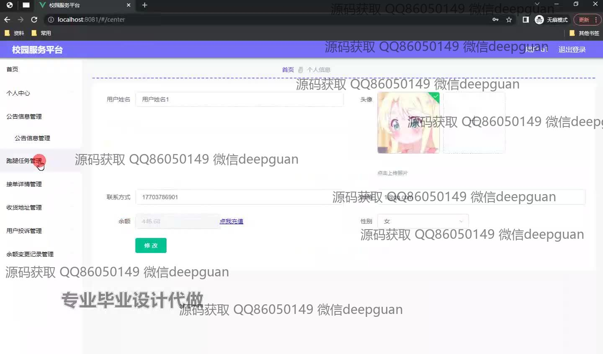
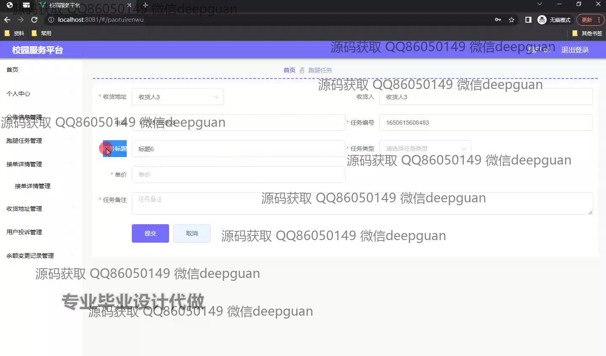
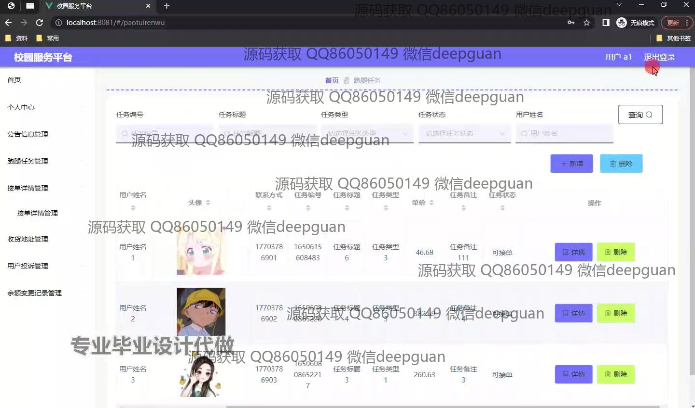
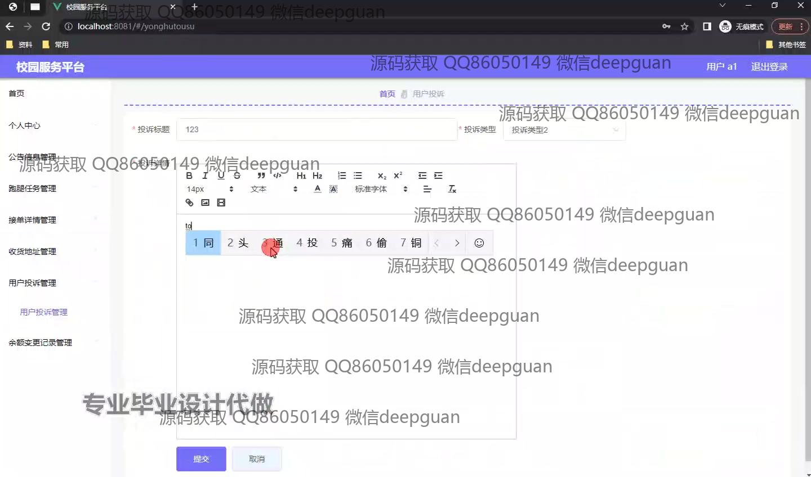
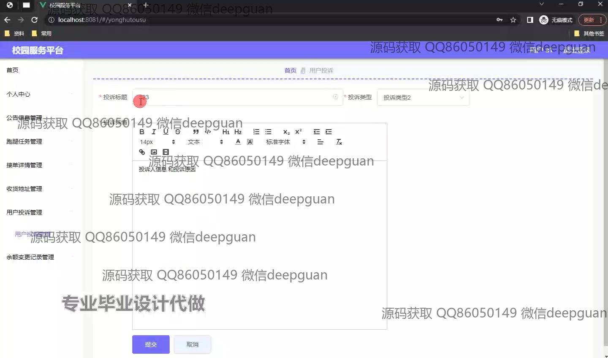
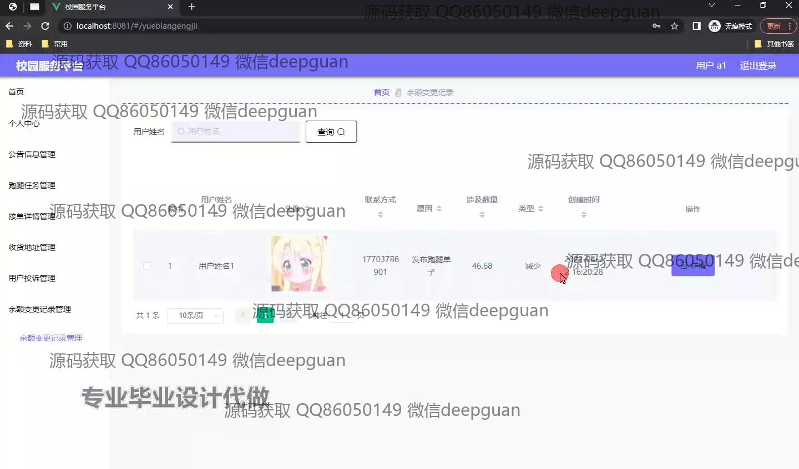
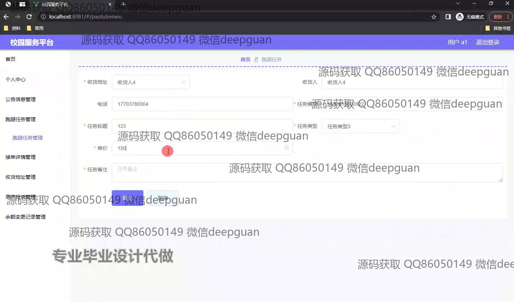
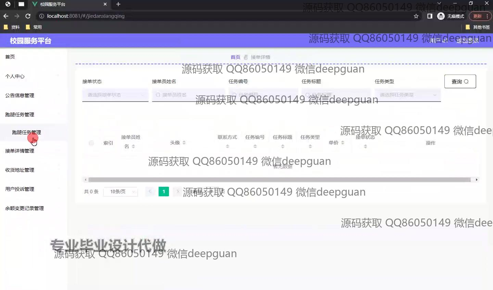
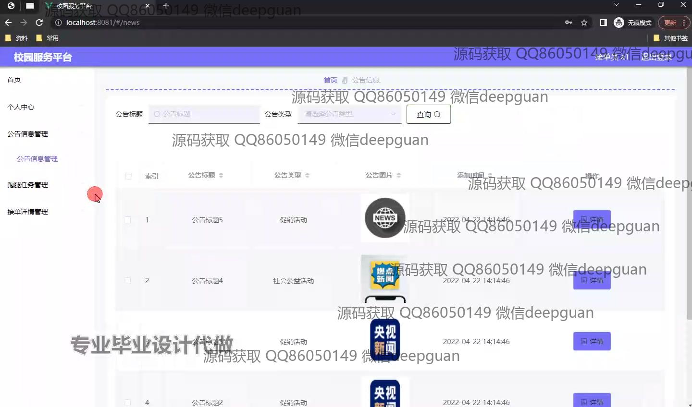
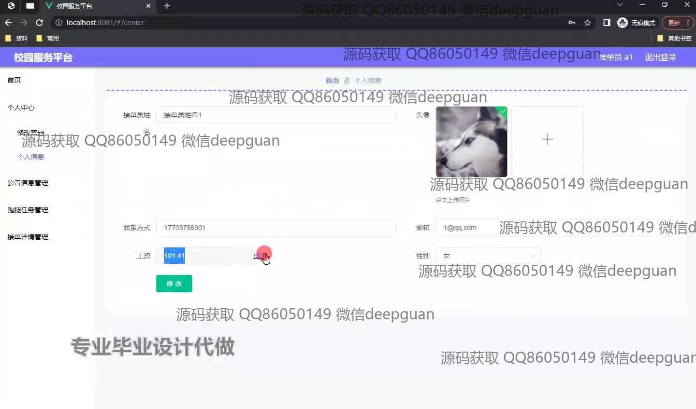
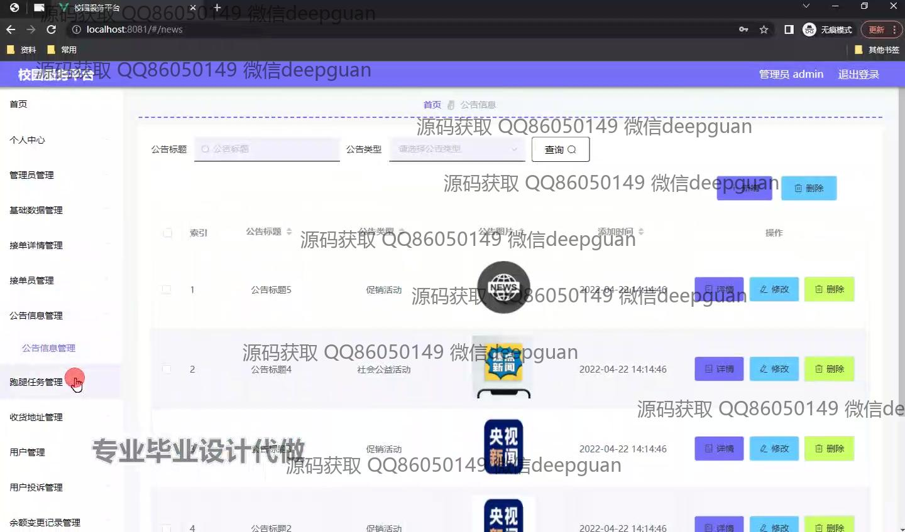
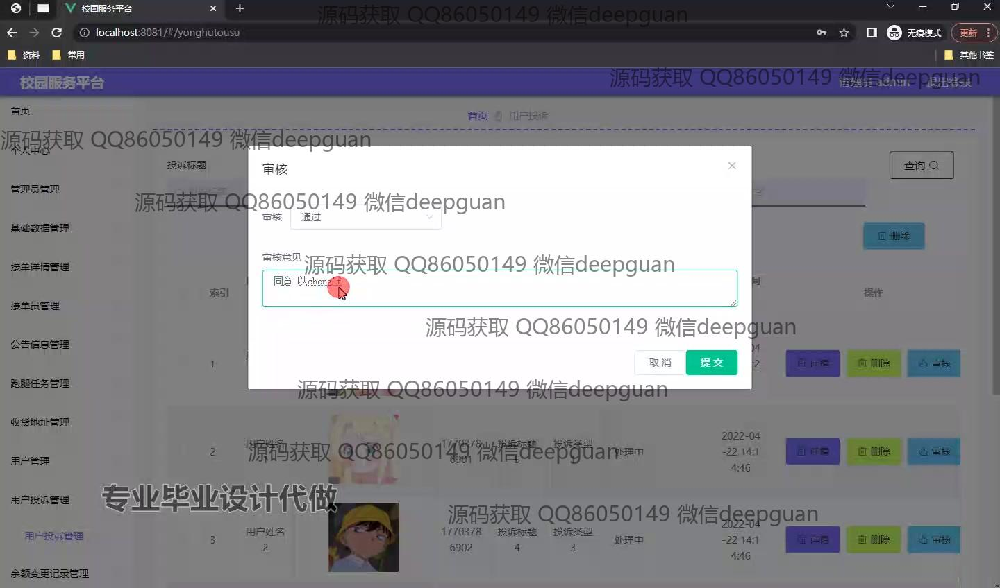

本代码来源于网络,仅供学习参考使用!

